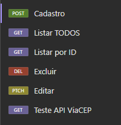

<h1>Desafio - API Rest da aplicação Voll.Med</h1>

  
Objetivos do projeto:

   
  
Criar a primeira API utilizando os verbos POST, PUT, GET e DELETE;

  
Entender o funcionamento da estrutura de um projeto Java utilizando o Spring Boot 3

  
Compreender o funcionamento das dependências de um projeto Spring Boot com o Maven

  

 

  
Informações da aplicação:

 

Como faço para acessar as tabelas?

 

O projeto utiliza o h2Database para permitir o acesso as tabelas da aplicação. Isso facilita na rodagem da aplicação, visto que, não será necessário instalar o MySQL ou qualquer outro software para começar a utilizar a aplicação, basta fazer o "run" na classe principal e pronto, o projeto estará funcionando! :)

O h2Database nos concede um servidor local, que é "startado" junto da aplicação. Ao acessá-lo, você conseguira fazer as requisições MySQL diretamente nas tabelas, para isso, basta acessar o link abaixo <b>quando o projeto estiver rodando</b>.

    http://localhost:8080/h2-console/login.do?jsessionid=29a0991dcaef3008cedcc1c67b539f87

 

Fazendo requisições:

 

Para realizar testes na aplicação, incluindo as funcionalidades de adicionar, editar, listar e excluir dados, <b>recomenda-se o uso de ferramentas como Postman ou Insomnia para enviar as requisições</b>. No entanto, sinta-se à vontade para utilizar qualquer outra ferramenta de sua preferência!

Mapa de verbos:

 
  

 

Cadastrando um médico:

 

Para cadastrar um médico, leve como base o seguinte exemplo de JSON: 

    POST -> http://localhost:8080/medicos

    {
        "nome": "Fulano de Tal",
        "email": "example@example.com",
        "crm": "123456",
        "especialidade": "ORTOPEDIA",
        "endereco": {
            "cep": "01310-913",
            "numero": "0",
            "complemento": "KM 125"
        }
    }

Foi implementado no projeto a <b>API ViaCEP</b>, que faz o preenchimento automático dos dados de endereço, somente através da digitação do CEP. <b>Pode-se acrescentar também, o número e complemento do endereço de forma opcional</b>, para serem adicionados ao cadastro. Saiba mais sobre a API acessando o site:

    
    https://viacep.com.br/

 

Listando todos os médicos cadastrados:

 

Se quisermos <b>listar todos os médicos cadastrados</b> na nossa aplicação, basta utilizarmos o seguinte comando:

    
    GET -> http://localhost:8080/medicos
    

Dessa forma, virá uma lista com todos os médicos que cadastramos.

 

Listando por ID:

 

Podemos ter um array com todos os médicos cadastrados, mas, e se quisermos capturar as informações de um em específico? Sem problemas! Para isso, use o seguinte comando:

    GET -> http://localhost:8080/medicos/NUMERO_ID

Com isso, basta substituir o <b>NUMERO_ID</b> pelo número de identificação do médico que deseja verificar, por exemplo, o 1 para capturar os dados do médico de ID = 1.

 

Atualizando dados de um cadastro já realizado:

 

É possível realizarmos a atualização de alguns campos dos dados de cadastro da nossa aplicação. Para isso, basta utilizarmos o seguinte comando:

    PATCH -> http://localhost:8080/medicos/2

    {
        "email": "email@teste.br"
    }

Nesse exemplo, estamos solicitando que seja feita a mudança do e-mail, mas, poderíamos passar qualquer outro campo na nossa requisição, até mesmo, vários campos de uma única vez para serem modificados, lembrando que, caso seja uma mudança de endereço, basta passar somente o CEP, número e complemento, que o restante será automáticamente completado pela API!

 

Excluindo cadastros:

 

Caso queiramos eliminar um cadastro de nossos registros é bem simples, basta utilizar o seguinte comando abaixo, mas, vale lembrar que <b>uma vez excluído, não é possível voltar com o cadastro novamente</b>, a menos que seja recadastrado novamente, mas, o número do ID acabará mudando.

    DELETE -> http://localhost:8080/medicos/NUMERO_ID

 

Testando a API ViaCEP:

   

Caso encontre algum problema no retorno dos dados de endereço, teste o CEP direto no método de testes da API e consulte o retorno, utilizando o seguinte comando:

    GET -> http://localhost:8080/viacep/NUMERO_DO_CEP

